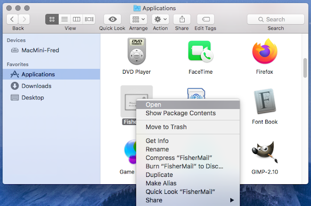
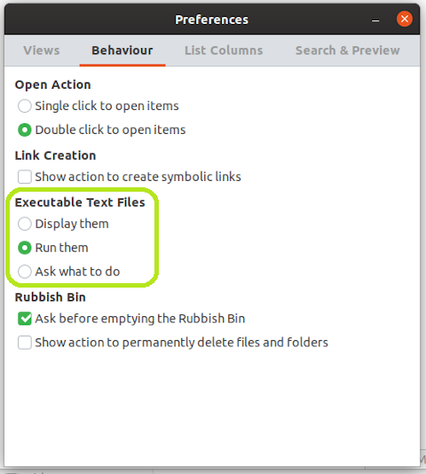

# FisherMail
cross-platform e-mail client  
(only for Gmail just yet)

## install
| type             | link                               |
|------------------|------------------------------------|
| cross-platform   | [FisherMail.jar](#cross-platform)  |
| macOs app        | [FisherMail-mac.zip](#macos-app)   |
| windows install  | [FisherMail-win.exe](#install-1)   |
| windows portable | [FisherMail-win.zip](#portable)    |
| linux deb        | [FisherMail-lin.deb](#deb-install) |
| linux rpm        | [FisherMail-lin.rpm](#rpm-install) |
| linux portable   | [FisherMail-lin.zip](#portable-1)  |  

_[ci](#continuous-integration)_  
_[uninstall](#uninstall)_

## cross-platform 
__*`Java 8 or newer with JavaFX required`*__

| download | [FisherMail.jar](https://jenkins.speederpan.com/job/mail-client-distrib/lastSuccessfulBuild/artifact/mail-client-distrib/distrib/FisherMail.jar) |
|----------|----------------------------------------------------------------------------------------------------------------------------------------------------|

#### windows
+ download and install the [latest version](https://www.java.com/en/download/) of Java  
+ double-click on downloaded file `FisherMail.jar`

#### macOs
+ download and install the [latest version](https://www.java.com/en/download/) of Java  
+ double-click on downloaded file `FisherMail.jar`

#### ubuntu
+ install Java and JavaFx  
```
sudo apt install default-jre openjfx
```  
+ start FisherMail with command
```
java \
--module-path /usr/share/openjfx/lib \
--add-modules=javafx.swing,javafx.web \
--add-exports=javafx.web/com.sun.webkit.network=ALL-UNNAMED \
--add-exports=javafx.base/com.sun.javafx=ALL-UNNAMED \
-Djdk.gtk.version=2.2 \
-client \
-jar FisherMail.jar
```

#### fedora
+ download the [latest version](https://www.java.com/en/download/) of Java  
+ install it
```
sudo rpm -vih jre-8u231-linux-i586.rpm
```
+ select it as default java
```
sudo alternatives --config java
```
+ start FisherMail with command
```
java -jar FisherMail.jar
```

## macOs app  
__*`shipped with Java runtime from Oracle`*__

| download | [FisherMail-macOs.zip](https://jenkins.speederpan.com/job/mail-client-distrib/lastSuccessfulBuild/artifact/mail-client-distrib/distrib/FisherMail-macOs.zip) |
|----------|---------------------------------------------------------------------------------------------------------------------------------------------------------------|
+ download and wait for the file to unzip
+ move FisherMail to the App folder

_security exception_  
macOs usually issue a warning when starting FisherMail and ultimately it can prevent FisherMail to start altogether  
to avoid this please follow these steps from Apple's [official guide](https://support.apple.com/en-gb/guide/mac-help/mh40616/mac)  
+ In the Finder on your Mac, locate FisherMail.  
_Don’t use Launchpad to do this. Launchpad doesn’t allow you to access the shortcut menu._
+ Control-click the FisherMail icon, then choose Open from the menu.
+ Click Open.  
_FisherMail is saved as an exception to your security settings, and you can open it in the future by double-clicking it just as you can any registered app._  



## windows  
__*`shipped with Java runtime from Oracle`*__
#### install
| download | [FisherMail-win64.exe](https://jenkins.speederpan.com/job/mail-client-distrib/lastSuccessfulBuild/artifact/mail-client-distrib/distrib/FisherMail-win64.exe)  |
|----------|----------------------------------------------------------------------------------------------------------------------------------------------------------------|
|          | [FisherMail-win32.exe](https://jenkins.speederpan.com/job/mail-client-distrib/lastSuccessfulBuild/artifact/mail-client-distrib/distrib/FisherMail-win32.exe) |
+ download and run the installation program
+ start FisherMail from windows menu

#### portable
| download | [FisherMail-win64.zip](https://jenkins.speederpan.com/job/mail-client-distrib/lastSuccessfulBuild/artifact/mail-client-distrib/distrib/FisherMail-win64.zip)  |
|----------|----------------------------------------------------------------------------------------------------------------------------------------------------------------|
|          | [FisherMail-win32.zip](https://jenkins.speederpan.com/job/mail-client-distrib/lastSuccessfulBuild/artifact/mail-client-distrib/distrib/FisherMail-win32.zip) |
+ download and unzip FisherMail
+ got to FisherMail unzipped folder and run ```FisherMail.exe```

## linux  
__*`shipped with Java runtime from Oracle`*__
#### deb install
| download | [FisherMail-lin64.deb](https://jenkins.speederpan.com/job/mail-client-distrib/lastSuccessfulBuild/artifact/mail-client-distrib/distrib/FisherMail-lin64.deb) |
|----------|---------------------------------------------------------------------------------------------------------------------------------------------------------------|
|          | [FisherMail-lin32.deb](https://jenkins.speederpan.com/job/mail-client-distrib/lastSuccessfulBuild/artifact/mail-client-distrib/distrib/FisherMail-lin32.deb) |
+ download and open with Software Install
+ click the Install button
+ start FisherMail from the launcher

#### rpm install
| download | [FisherMail-lin64.rpm](https://jenkins.speederpan.com/job/mail-client-distrib/lastSuccessfulBuild/artifact/mail-client-distrib/distrib/FisherMail-lin64.rpm) |
|----------|---------------------------------------------------------------------------------------------------------------------------------------------------------------|
|          | [FisherMail-lin32.rpm](https://jenkins.speederpan.com/job/mail-client-distrib/lastSuccessfulBuild/artifact/mail-client-distrib/distrib/FisherMail-lin32.rpm) |
+ download and open with Software Install
+ click the Install button
+ start FisherMail from the launcher

#### portable
| download | [FisherMail-lin64.zip](https://jenkins.speederpan.com/job/mail-client-distrib/lastSuccessfulBuild/artifact/mail-client-distrib/distrib/FisherMail-lin64.zip) |
|----------|---------------------------------------------------------------------------------------------------------------------------------------------------------------|
|          | [FisherMail-lin32.zip](https://jenkins.speederpan.com/job/mail-client-distrib/lastSuccessfulBuild/artifact/mail-client-distrib/distrib/FisherMail-lin32.zip) |
+ download and unzip FisherMail
+ got to FisherMail unzipped folder and run ```FisherMail.sh```

_executable text files_  
by default most distributions won't run script files but will display their content instead
to allow FisherMail to start normally, go to Files > Preferences > Behaviour and select Executable Text Files > Run them



## continuous integration
latest build available in [Jenkins](https://jenkins.speederpan.com/job/mail-client-distrib%20(continuous))

## uninstall

#### windows 10
+ select Windows > Settings > Apps > Apps & features
+ select FisherMail and click Uninstall

#### macOs
+ open the Finder and go to Applications
+ select FisherMail and drop it over the Trash icon

### ubuntu
+ open a terminal window
+ execute the command ```sudo apt -y remove fishermail```

### fedora
+ open a terminal window
+ execute the command ```sudo dnf -y remove mail-client-distrib```


